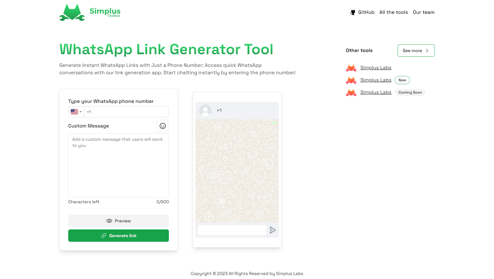

> 🌐 [¿No hablas inglés? Haz clic aquí para la versión en español.](docs/README-ES.md)

<h1 align="center">WhatsApp Link Generator Tool</h1>

  <a href="#tech-stack--features">🌟 <strong>Features</strong></a> ·
  <a href="#tech-stack--features">🧰 <strong>Tech Stack</strong></a> ·

 

**WhatsApp Link Generator Tool** is a simple and user-friendly web application that allows people to create WhatsApp contact links effortlessly. With this tool, users can input a phone number and a custom message, and it will generate a WhatsApp link for them. Additionally, it provides a QR code for the link and allows users to download it as an image.

## 🌟 Features

- 📱 **Easy WhatsApp Link Creation**: Quickly generate WhatsApp contact links with just a phone number and a custom message.
- 🎨 **QR Code Generation**: The tool generates a QR code for the WhatsApp link, making it easy to share or scan.
- 💻 **Image Download**: Users can download the QR code as an image for offline use.
- 🖼️ **User-Friendly Interface**: The tool is designed for a seamless and intuitive user experience.

## 🧰 Tech Stack

- [![React][React]][React-url]
- [![TypeScript][TypeScript]][TypeScript-url]
- [![ShadcnUI][ShadcnUI]][ShadcnUI-url]
- [![Tailwind][Tailwind]][Tailwind-url]

## 📜 License

This project is licensed under the MIT License. See [LICENSE](CODE_OF_CONDUCT.md) for more information.

[React]: https://img.shields.io/badge/React-61DAFB.svg?style=for-the-badge&logo=React&logoColor=black
[React-url]: https://reactjs.org/
[TypeScript]: https://img.shields.io/badge/TypeScript-3178C6.svg?style=for-the-badge&logo=TypeScript&logoColor=white
[TypeScript-url]: https://www.typescriptlang.org/
[ShadcnUI]: https://img.shields.io/badge/ShadcnUI-000000.svg?style=for-the-badge&logo=ShadcnUI&logoColor=white
[ShadcnUI-url]: https://shadcn.com/
[Tailwind]: https://img.shields.io/badge/Tailwind%20CSS-06B6D4.svg?style=for-the-badge&logo=Tailwind-CSS&logoColor=white
[Tailwind-url]: https://tailwindcss.com/