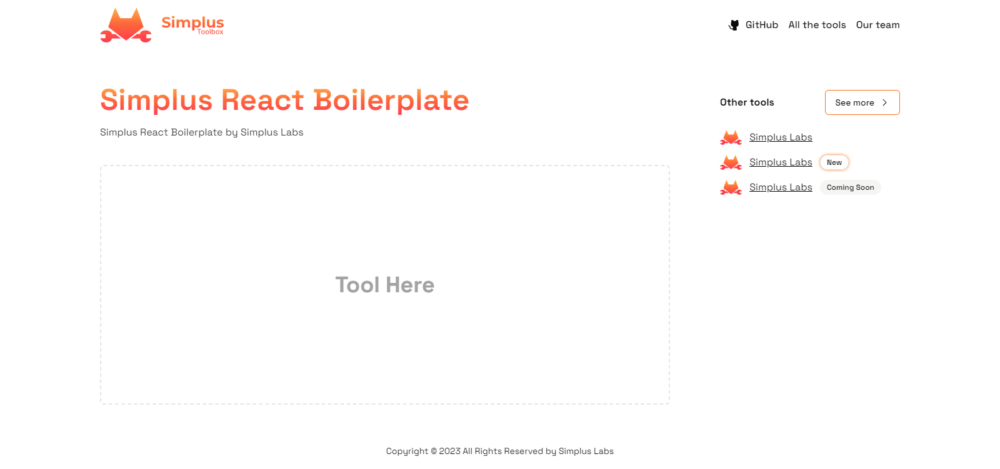

> 🌐 [Don't speak Spanish? Click here for the English version.](README.md)

<h1 align="center">🛠 Simplus React Boilerplate 🛠</h1>

<p align="center">
  <a href="#características">🌟 <strong>Características</strong></a> ·
  <a href="#tecnologías">🧰 <strong>Tecnologías</strong></a> ·
  <a href="#personalizar">✨ <strong>Personalizar</strong></a>
</p>
<br/>



## 🌟 Características
- 🛠 **Diseño Consistente para Simplus Toolbox**: Una estructura de diseño que garantiza coherencia en todas las herramientas de Simplus Toolbox.
- 📱 **Diseño Responsive**: Diseñado para verse y funcionar perfectamente en dispositivos de todos los tamaños.
- 🎨 **Cambio Rápido de Tema**: Cambia rápidamente la apariencia de tu herramienta seleccionando entre una gama de temas personalizados.
- 💻 **Estandarización y Calidad del Código**: Mantén un código limpio y consistente con herramientas líderes como ESLint, Prettier y Commitlint.

## 🧰 Tecnologías

- [![React][React]][React-url]
- [![TypeScript][TypeScript]][TypeScript-url]
- [![ShadcnUI][ShadcnUI]][ShadcnUI-url]
- [![Tailwind][Tailwind]][Tailwind-url]
- [![Commitlint][Commitlint]][Commitlint-url]
- [![ESLint][ESLint]][ESLint-url]
- [![Prettier][Prettier]][Prettier-url]
- [![Vite][Vite]][Vite-url]

## ✨ Personalizar

¿Listo para hacer esta plantilla única para ti? Así es cómo:

1. **Información Meta**: Comienza personalizando la identidad del proyecto.
   - 📝 Dirígete al archivo `index.html`.
   - 🖋 Actualiza todos los títulos y meta tags para que coincidan con el nombre, la descripción y otros detalles de tu herramienta.

2. **Adaptación de Tema**: Da forma a la experiencia visual de tu herramienta.
   - 🎨 Establece tu tema deseado modificando la etiqueta `<body>`.
   
```html
<body class="yellow-gradient">
  <div id="root"></div>
</body>
```

3. **Elige entre Nuestros Temas**: Ya sea que prefieras un Zinc minimalista o un Rose vibrante, te tenemos cubierto. Selecciona de una rica paleta de temas diseñados para una experiencia de usuario impecable.

### 🎨 Lista de temas

| Tema  | Clase | Previsualización |
| ------------- | ------------- | ------------- |
| Zinc | zinc-gradient |   |
| Slate | slate-gradient |  |
| Stone | stone-gradient |  |
| Gray | gray-gradient |  |
| Neutral | neutral-gradient |  |
| Red | red-gradient |  |
| Rose | rose-gradient |  |
| Green | green-gradient |  |
| Blue | blue-gradient |  |
| Yellow | yellow-gradient |  |
| Violet | violet-gradient |  |

## 📜 Licencia

Este proyecto está bajo la licencia MIT. Consulta [LICENCIA](../CODE_OF_CONDUCT.md) para más información.

[SimplusLabs-url]: https://github.com/Simplus-Labs/
[React]: https://img.shields.io/badge/React-61DAFB.svg?style=for-the-badge&logo=React&logoColor=black
[React-url]: https://reactjs.org/
[TypeScript]: https://img.shields.io/badge/TypeScript-3178C6.svg?style=for-the-badge&logo=TypeScript&logoColor=white
[TypeScript-url]: https://www.typescriptlang.org/
[ShadcnUI]: https://img.shields.io/badge/ShadcnUI-000000.svg?style=for-the-badge&logo=ShadcnUI&logoColor=white
[ShadcnUI-url]: https://shadcn.com/
[Tailwind]: https://img.shields.io/badge/Tailwind%20CSS-06B6D4.svg?style=for-the-badge&logo=Tailwind-CSS&logoColor=white
[Tailwind-url]: https://tailwindcss.com/
[Vite]: https://img.shields.io/badge/Vite-646CFF.svg?style=for-the-badge&logo=Vite&logoColor=white
[Vite-url]: https://vitejs.dev/
[Commitlint]: https://img.shields.io/badge/commitlint-000000.svg?style=for-the-badge&logo=commitlint&logoColor=white
[Commitlint-url]: https://commitlint.js.org/
[ESLint]: https://img.shields.io/badge/ESLint-4B32C3.svg?style=for-the-badge&logo=ESLint&logoColor=white
[ESLint-url]: https://eslint.org/
[Prettier]:https://img.shields.io/badge/Prettier-F7B93E.svg?style=for-the-badge&logo=Prettier&logoColor=black
[Prettier-url]: https://prettier.io/